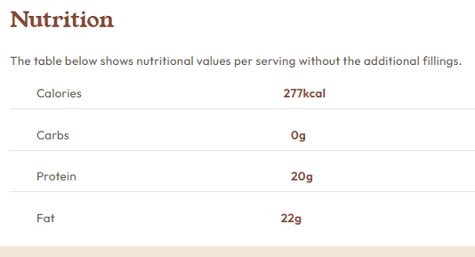

# Projeto Receita

- O objetivo desse  projeto foi testar o conhecimento que estou adquirindo com o curso Dev Quest, nesse projeto tive um pouco de dificuldade na seção de nutrição, por que estava com dificuldade de alinhar os valores da informações, eu havia usado no html, uma lista desordenada, e na hora de centralizar ao valores das informações tava dando errado por que os textos tinha tamanhos diferentes, vou deixar o print da tela para melhor entendimento dessa minha dificuldade, para resolver alterei essa seção no html para uma tag table, dai foi muito mais fácil centralizar, e aprendi a usar o border-collapse, esse projeto foi muito bom para fixar ainda mais meu aprendizado.

# Tecnologias utilizadas 

- HTML
- CSS 